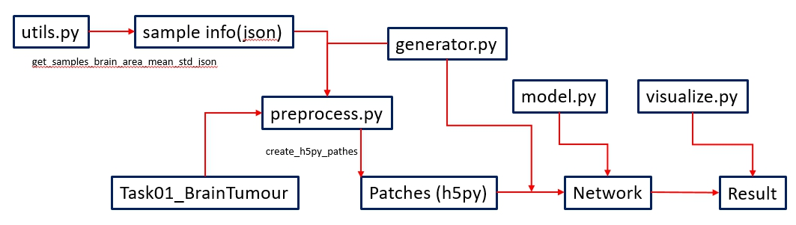
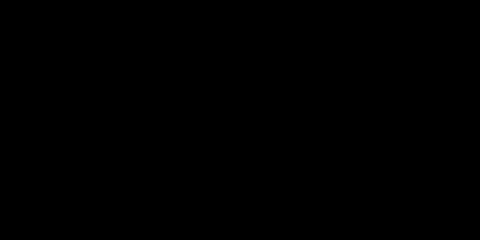

# 3D-Unet-on-Brain-MRI
Practice for 3D Unet on Brain MRI

Four MR images of one person’s brain. From the left: T1, T1C, T2, FLAIR. Source: Pereira et al 
# Brain MRI Tumor Segmentation wih 3D-Unet
This is the practice for the papper [3D U-net](https://arxiv.org/abs/1606.06650).

## Before Starting
- Download the dataset from [Decathlon 10 Challenge](https://decathlon-10.grand-challenge.org). Choose `Task01_BrainTumour` and unpack.
- Prepare the file path like the following:

  in root: 
  
  (file) `generator.py` , `model.py`, `preprocess.py`, `utils.py`, `visualize.py`
  
  (dir)  `Task01_BrainTumour`,  `preprocess/train`,  `preprocess/validation`, `tmp`

## Process Flow
-  For normalization, the samples will be calculated the mean ans standard deviation in advance and saved as json file.
-  The raw image will be devides into patches (also normalized) to reduce memory usage.
- generator is used to create patches and load from patches for training.

## Self-defined module:
- preprocess.py: create the patches needed for training.
- utils.py: some useful fuctions
- visualize.py: used to draw plots and visulization
- generator.py: define the generator for reading the raw data (for generating pathces) or reading the patches (for training process)
- model.py: define the 3D Unet structure

## Model Structure:
The model with has contraction and expanding path with depth 4. The input shape in (120, 120, 32) in our case. The details are in model.py

## Visualization of the Predicted Result
The following shows the gif animation along z direction.
The left is ground truth and the right is the predicted label.
- Red: Edema
- green: non-enhancing tumor
- blue: enhancing tumor

## More details

For more details, check this [notebook](https://github.com/mousekinga82/3D-Unet-on-Brain-MRI/blob/master/3D_Unet_on_Brain_MRI.ipynb).
